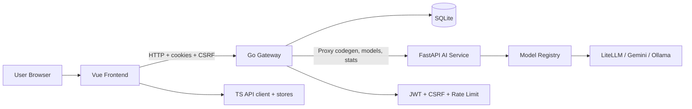

# Lio AI: A Plug-and-Play Platform for Document-Aware AI Chat and Code Generation

**Author(s):** _[Your Name / Team Name]_  
**Date:** 2026-05-26  
**Repository:** https://github.com/su-network/lio-ai (default branch: `master`)  
**Artifact Type:** Research Experience / Technical Project Report

## Contents

- [Abstract](#abstract)
- [1. Problem Statement and Motivation](#1-problem-statement-and-motivation)
- [2. At-a-Glance Summary](#2-at-a-glance-summary)
- [3. System Overview](#3-system-overview)
- [4. Architecture](#4-architecture)
- [5. Implementation Highlights by Language](#5-implementation-highlights-by-language)
- [6. Evaluation and Validation](#6-evaluation-and-validation)
- [7. Limitations and Future Work](#7-limitations-and-future-work)
- [8. Reproducibility](#8-reproducibility)
- [9. References and Related Materials](#9-references-and-related-materials)

## Abstract

This report documents the design and implementation of **Lio AI**, an end-to-end platform that combines document management, conversational AI, and code generation in a single developer workflow. The current implementation integrates a Vue 3 frontend, a Go API gateway, and a Python FastAPI model orchestration service. The system emphasizes “plug-and-play” operation through Makefile-driven local development and Docker-based quickstart, while providing authenticated chat, document CRUD, model selection, usage tracking, and proxy-based code-generation endpoints.

## 1. Problem Statement and Motivation

Modern AI-assisted development workflows are often fragmented: one tool for document handling, another for chat, and another for model-backed code generation. This fragmentation increases integration cost and complicates reproducibility.

Lio AI addresses this by providing a unified stack where users can:
- upload/manage documents,
- run authenticated chat sessions with persisted message history,
- invoke AI-backed code generation and model endpoints through a consistent gateway.

The project motivation, as reflected in repository description (“upload, chat and much more”), is to reduce setup friction and provide an extensible base for AI-enabled application workflows.

## 2. At-a-Glance Summary

- **Core user workflow:** manage documents, run chats, and trigger code-generation/model operations from one stack.
- **Frontend:** Vue 3 + TypeScript + Pinia application for authenticated UI flows.
- **Gateway:** Go + Gin service exposing auth, documents, chats, usage, system info, and proxy routes.
- **AI backend:** Python FastAPI service for model registry, code generation, chat completion, and model health/status.
- **Persistence:** SQLite tables for users, documents, chats, messages, quotas, usage metrics, and provider API keys.
- **Security controls:** JWT auth, CSRF protection, and rate limiting are enabled in the gateway.

## 3. System Overview

The current implementation supports:
- **Frontend UX (Vue + TypeScript):** chat interface, model/status views, settings/API-key interactions, and document/code-generation workflows (`frontend/src`).
- **Gateway/API layer (Go + Gin):** auth, document/chat/usage/system routes, plus protected proxying to AI service (`joles/cmd/server/main.go`).
- **AI orchestration service (Python + FastAPI):** model registry, model status/reload, code generation, chat completion, and health/statistics endpoints (`ai/app/main.py`).
- **Persistence and accounting:** SQLite-backed tables for users, documents, chats/messages, usage metrics, quotas, and provider API keys (`joles/internal/db/database.go`).

### 3.1 Feature Coverage in the Current Implementation

- **Document management:** document CRUD endpoints in Go and document views/store in frontend.
- **Chat:** persisted chats/messages, conversation UUID routes, and model-backed chat completion.
- **Code generation:** protected gateway proxy routes to FastAPI generation/validation/RAG endpoints.
- **Model management:** model listing, status, recommendation, and API-key synchronization flows.
- **Operational monitoring:** health, metrics, usage, quota, and statistics endpoints.

## 4. Architecture



### 4.1 Data/Control Flow Summary
1. Frontend sends requests to gateway endpoints (auth/doc/chat/usage/system).
2. Gateway enforces middleware (JWT, CSRF, rate limit) and handles local persistence where applicable.
3. AI-oriented calls are proxied to the FastAPI service.
4. FastAPI selects/validates models and executes generation/chat operations through provider adapters.
5. Responses are returned to frontend for rendering and interaction continuity.

### 4.2 Text Fallback for the Diagram

If Mermaid rendering is unavailable in the viewer, the deployed structure is:

- **Browser → Vue frontend**
- **Vue frontend → Go gateway** for authenticated application requests
- **Go gateway → SQLite** for app data and metrics persistence
- **Go gateway → FastAPI AI service** for code generation, chat completion, model endpoints, and stats
- **FastAPI AI service → external/local model providers** through registry/provider abstractions

## 5. Implementation Highlights by Language

### 5.1 Vue (UI and Interaction Layer)
- Composition API + Pinia store pattern (`frontend/src/main.ts`, `frontend/src/stores/*`).
- Auth-gated routing with login/register/profile flows (`frontend/src/router/index.ts`).
- Chat state management with conversation UUID support and model selection (`frontend/src/stores/chat.ts`).
- Frontend README documents feature scope including document upload, chat, and code generation (`frontend/README.md`).

### 5.2 Go (Gateway, Business APIs, Security Middleware)
- Gin router composition for `/api/v1/auth`, `/documents`, `/chats`, `/usage`, `/system`, `/api-keys` (`joles/cmd/server/main.go`).
- Proxy groups to AI service for `/api/v1/codegen/*`, `/api/v1/models/*`, and `/api/v1/stats`.
- Security middleware includes JWT auth and CSRF token verification (`joles/internal/middleware/auth_middleware.go`, `joles/internal/middleware/csrf.go`).
- SQLite migrations define core operational schema (`joles/internal/db/database.go`).

### 5.3 Python (Model Orchestration and AI Serving)
- FastAPI application with lifecycle initialization for model registry and prompt manager (`ai/app/main.py`).
- Multi-model code generation orchestration with async parallel execution and retry policies (`ai/app/services/code_generation.py`).
- Provider abstraction and API-key-aware model availability (`ai/app/services/model_registry.py`).
- Config-driven prompts/models (`ai/config/prompts.yaml`, `ai/config/models.yaml`).

### 5.4 TypeScript (Client Utilities and API Integration)
- Centralized API client with typed request/response structures and interceptors (`frontend/src/services/api.ts`).
- CSRF header injection for state-changing requests and cookie-based auth integration.
- Utility-level response obfuscation/deobfuscation helpers (`frontend/src/utils/encryption.ts`), currently documented in code as lightweight obfuscation (not strong encryption).

## 6. Evaluation and Validation

### 6.1 Testing Strategy
- Makefile defines primary validation paths: `make test`, `make build`, `make lint`, `make vet`, `make test-coverage`.
- In this environment:
  - `make build` succeeds for Go gateway.
  - `make test` currently fails due to pre-existing compile/test issues under `joles/tests`.
  - `make lint` expects `golangci-lint` installed.

This indicates the repository has an existing validation scaffold, though CI/local setup may require dependency/tool alignment.

### 6.2 Performance Considerations
- AI service executes model calls concurrently for code generation (`asyncio.gather` with timeout/retry).
- Model selection attempts to balance capability, cost, and latency factors (`ModelRegistry.select_models`).
- Gateway includes rate-limiting middleware and usage metrics/cost tracking endpoints.

### 6.3 Security and Privacy Considerations
- JWT-based authentication with protected API groups.
- CSRF defenses for state-changing requests via token cookie/header match.
- Provider API keys are handled via dedicated backend routes and persisted in encrypted form at rest (`provider_api_keys` table schema indicates encrypted storage field).
- Frontend utility obfuscation should not be interpreted as cryptographic protection; production-grade cryptography should remain server-side.

## 7. Limitations and Future Work

Current limitations (from implementation and docs):
- Validation status is not fully green in baseline local testing (`make test` failures in current state).
- Some security/performance capabilities are scaffolded but could be hardened further (e.g., stronger client-side secret handling assumptions, broader test coverage).
- Documentation is currently sparse at repository root; architecture and operational docs can be expanded.

Suggested future work:
- Stabilize and expand automated tests across Go/Python/frontend boundaries.
- Add structured benchmarks (latency/cost/quality comparisons across models).
- Introduce richer observability dashboards and SLO-based alerting.
- Extend RAG/document ingestion pipelines with stronger provenance and evaluation metrics.

## 8. Reproducibility

The following steps are directly derived from repository docs and Makefile targets.

### 8.1 Quickstart via Docker (root README)
```bash
docker build -t lio-ai .
docker run --rm -p 8080:8080 lio-ai
```

### 8.2 Local Multi-Service Development (Makefile)
```bash
make deps        # install/check Go + Python + frontend dependencies
make build       # build Go gateway
make ai-dev      # start FastAPI AI service in background
make frontend-dev
make dev         # orchestrated dev mode (Go + Python + frontend)
make status      # service status
make stop-all    # stop everything
```

### 8.3 Default Local Endpoints

- Go gateway: `http://localhost:8080`
- Python AI service: `http://localhost:8000`
- Frontend dev server: `http://localhost:5173` from `make dev` and `http://localhost:3000` in `frontend/README.md`

### 8.4 Validation Commands
```bash
make test
make test-coverage
make vet
make lint
```

## 9. References and Related Materials

1. **Repository root README**: `/README.md`  
2. **Frontend documentation**: `/frontend/README.md`  
3. **Gateway entrypoint and routing**: `/joles/cmd/server/main.go`  
4. **Gateway system/metrics handler**: `/joles/internal/handlers/system_handler.go`  
5. **Database schema/migrations**: `/joles/internal/db/database.go`  
6. **Security middleware**: `/joles/internal/middleware/auth_middleware.go`, `/joles/internal/middleware/csrf.go`  
7. **FastAPI app**: `/ai/app/main.py`  
8. **Model/codegen services**: `/ai/app/services/model_registry.py`, `/ai/app/services/code_generation.py`  
9. **Model/prompt configs**: `/ai/config/models.yaml`, `/ai/config/prompts.yaml`

---

_End of report._
